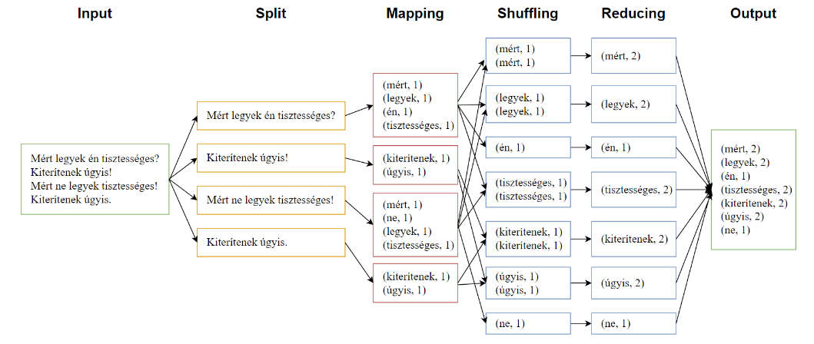

# Hadoop

A Apache Hadoop egy nyílt forráskódú szoftvergyűjtemény, mely nagy mennyiségű adat elosztott feldolgozását teszi lehetővé.

A Google [MapReduce](https://research.google/pubs/pub62/) és [File System](https://research.google/pubs/pub51/) technológiák leírásain alapszik, két fő része a Hadoop elosztott fájlrendszer (HDFS)  és MapReduce motor.

## HDFS
A HDFS egy a Hadoop által használt elosztott fájlrendszer, melyet nagy mennyiségű adat hibatűrő tárolására fejlesztettek ki.

A HDFS, a fájlokat maximum 128MB-os blokkokra bontva tárolja, több különböző számítógépen (node). Emellett a hibatolerancia növelése érdekében az egyes blokkokról replikákat (alapból 3 db) tárol, különböző rack-be (gépek egy csoportja) tartozó node-okon.

## MapReduce

A MapReduce egy programozási modell, ami nagy mennyiségű adat elosztott feldolgozását teszi lehetővé.

Alapvetően öt fázisból áll:
1. Bementi adatok felosztása
2. A felosztott adatok leképezése kulcs-érték párokká
3. Az azonos kulcsú párok összegyűjtése
4. Az összegyűjtött azonos kulcsú párok aggregálása
5. Kimenet előállítása

<figure>

<figcaption>Forrás: <a href='https://vargadaniel.web.elte.hu/'>Varga Dániel</a> </figcaption>
</figure>

Minden fázis végén hálózati adatmozgatás történik, ezért a shuffle fázis elé bevezethetünk egy opcionális combine fázist, 
ami lokálisan elvégzi a reducer feladatának egy részét.

A következő fejezetekben gyakorlati feladatokon keresztül ismerkedünk meg a Hadoop MapReduce sajátosságaival.

