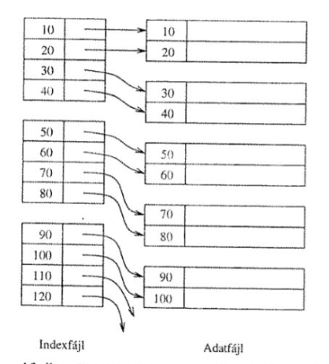
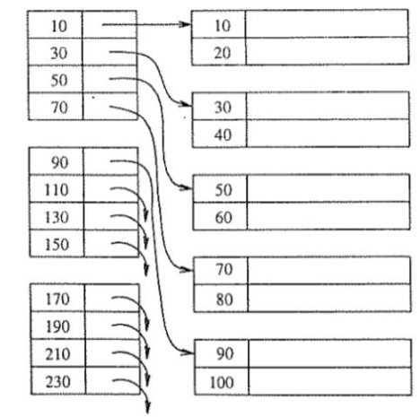
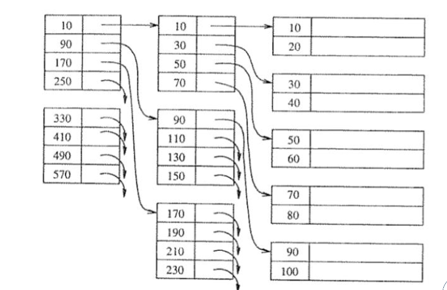

# Másodlagos indexek
Az elsődleges indexel, a fizikai elrendezés adta lehetőséget elhasználtuk. Ennek ellenére van lehetőségünk további
indexek létrehozására. Nyilvánvalóan az e célra létrehozott segédstruktúrákat is tárolnunk kell, de mivel csak mutatókat
fogunk tárolni az adatra, ezért az a tárhely igény a tábla méretéhez képest elhanyagolható.

## Sűrű index
Minden rekordot egy mutatót rendelünk, melyeket szekvenciálisan az adott oszlop(okban) szereplő értékek szerint
rendezve tárolunk.

## Ritka index
A sűrű indexhez nagyon hasonló, de rekordok helyett blokkokra tárolunk mutatókat. A rendezés alapjául szolgáló kulcs
az adatblokkban szereplő első rekord megadott oszlopának (esetleg oszlopainak) értéke.

## Többszintű index

Az indexre is tudunk indexet készítene, mellyel tovább tudjuk növelni a hatékonyságot.

:::info
Többszintű index esetén csak az alsó szint lehet sűrű. Ez logikus, hiszen bármely azonos oszlopra készített sűrű index
pontosan ugyanazokat a mutatókat tartalmazza (legfeljebb a sorrendjük tér el [stabil rendezés esetén még ez sem]).
:::

## Indexek tárhelyigénye

Az indexek tárhelyigényének vizsgálatához vezessük be a következő fogalmakat:
- $\mathrm{T}{(R)}$: az $R$ reláció sorainak száma
- $\mathrm{B}{(R)}$: az $R$ reláció tárolásához szükséges blokkok száma
- blokkolási faktor:
  - $\mathrm{bf}{(R)}$: azt adja meg az $R$ reláció hány sora fér el egy blokkban
  - $\mathrm{bf}{(I)}$: azt adja meg az $I$ index hány kulcs-érték párja fér el egy blokkban

:::tip Példa
Legyen $R$ táblák, sűrű $I_1$ és ritka $I_2$ indexek úgy, hogy $\mathrm{T}{(R)} = 10000$, $\mathrm{bf}{(R)} = 20$,
$\mathrm{bf}{(I_1)} = 100$, $\mathrm{bf}{(I_2)} = 100$. Számoljuk ki hány blokk szükséges az említett struktúrák
tárolásához.

$$
\mathrm{B}{(R)} = \frac{\mathrm{T}{(R)}}{\mathrm{bf}{(R)}} = \frac{10000}{20} = 500
$$

Mivel $I_1$ egy sűrű index ezért mind a 10000 rekordra el kell tárolnunk 1-1 mutatót:
$$
\mathrm{B}{(I_1)} = \frac{\mathrm{T}{(R)}}{\mathrm{bf}{(I_1)}} = \frac{10000}{100} = 100
$$

Mivel $I_2$ egy irtka index ezért minden blokkra kell csak mutatót tárolnunk:

$$
\mathrm{B}{(I_2)} = \frac{\mathrm{B}{(R)}}{\mathrm{bf}{(I_2)}} = \frac{500}{100} = 5
$$
:::

:::tip Példa
Oldjuk meg az előző feladatot úh, hogy csak a blokkok $80\%$-a legyen tele!

Ez pontosan azt jelenti, hogy $20\%$-al kevesebb rekord vagy kulcs-mutató pár fér egy blokkba. Így
$\mathrm{bf}{(R)} = 16$, $\mathrm{bf}{(I_1)} = 80$, $\mathrm{bf}{(I_2)} = 80$.

$$
\begin{align*}
\mathrm{B}{(R)} &= \frac{\mathrm{T}{(R)}}{\mathrm{bf}{(R)}} = \frac{10000}{16} = 625 \\
\mathrm{B}{(I_1)} &= \frac{\mathrm{T}{(R)}}{\mathrm{bf}{(I_1)}} = \frac{10000}{80} = 125 \\
\mathrm{B}{(I_2)} &= \frac{\mathrm{B}{(R)}}{\mathrm{bf}{(I_2)}} = \frac{625}{80} = 7,8125 \approx 8 \\
\end{align*}
$$

::::::danger
Tároláshoz mindig egész blokkok vannak használva, tehát ha egy index mérete 7,0005 blokk lenne az index ténylegesen 8
blokkot fog elfoglalni.
::::::
:::
