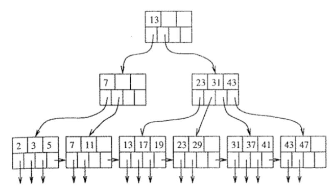
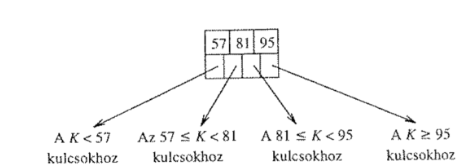
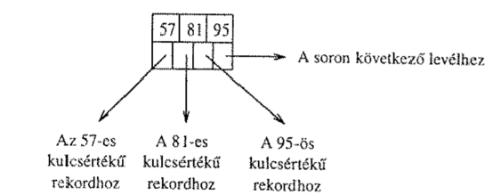
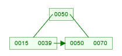
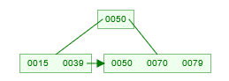
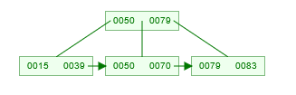
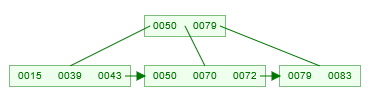
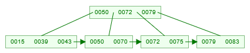
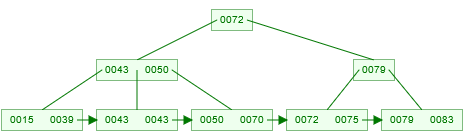

# B+ fa index

A többszintű indexekből szinte természetesen következik, egy már az Algoritmusok és adatszerkezetek II. tárgyon
megismert adatszerkezet a B+ használata. A B+ fa egy olyan fa, melynek csúcsai $k$ kulcsot és $(k+1)$ mutatót
tartalmaznak.

Egy csúcs $i$-edik mutatója által hivatkozott részfában, minden $k$ kulcsra igaz, nagyobb $(i - 1)$-edik és szigorúan
kisebb az $i$-edik kulcsnál.

Első mutató esetén az alsó határt $-\infty$-ként a felső határt $+\infty$-ként definiáljuk.

A levélszintben a mutatók a tábla konkrét rekordjaira mutatnak, ezáltal sűrű indexet alkotnak. A levelek utolsó mutatói 
a következő levélre mutatnak, ezzel biztosítva az intervallum alapú lekérdezések hatékonyságát.

## B+ fa építése

Építsünk B+ fát a következő értékekből: 39, 15, 50, 70, 79, 83, 72, 43, 75, 45. A mutatók száma csúcsonként legyen 3.

A 39, 15, 50 beszúrását gond nélkül el tudjuk végezni, mivel van hely a kezdőcsúcsban:

A 70 beszúrásánál azonban, már nincs hely a csúcsban azért el fel kell osztanunk azt.
Az első új csúcsba helyezzük a 15 és 39 kulcsokat, a másodikba az 50, 70 kulcsokat.
Az eredeti csúcsban a második csúcs minimuma kerül.

A 79 könnyen beszúrható

A 83 beszúrásánál szét kell osztanunk a csúcsot. A szinten még van hely, ezért nem kell új gyökércsúcsot felvenni.

A 72 és 43 gond nélkül beszúrható:

A 75 beszúrásakor szét kell osztanunk a csúcsot:

A 45-öt a $<50$ részfába, akarjuk beszúrni, ez a részfa azonban már tele van azért két részre bontjuk a csúcsot:
(15, 39), (43, 45) a gyökércsúcsban viszont már nincs hely ezért meg kell növelnünk a B+ fa magasságát. Ehhez két új
csúcsot fogunk beszúrni egyet ami (15, 39), (43, 45), (50, 70) csúcsokra mutat és egyet ami a (72, 75), (79,83)
csúcsokra mutat. Ezek a (43, 50) és (79) csúcsok lesznek. A gyökér csúcsban a (79) gyökerű részfa minimuma fog kerülni.

## B+ index tárigénye

Legyen az $R$ reláció sorainak száma 1 000 000. Legyen a reláció blokkolási faktora $\mathrm{bf}(R) = 20$. Készítsünk
egy olyan $I$ B+ fa indexet, melynek blokkolási faktora 50! Legrosszabb esetben hány blokkot kell beolvasnunk egy
konkrét sor megtalálásához?

Tudjuk, hogy B+ fa legalsó szintje egy sűrű index, mivel egy blokkba $50$ kulcs-mutató pár fér, ezért
$\frac{1000000}{50}=20000$ blokkba fér el a fa alsó szintje. Ezt követően erre a $20000$ blokkra fogunk ritka indexet
készíteni $\frac{20000}{50} = 400$. Ezen $400$ blokkra készített ritka index $8$ blokkban fér el. Végül a $8$ blokkra
$1$ blokkot elfoglaló ritka indexet készítünk.

Így a fa összesen $20409$ blokknyi tárhelyet foglal el.
 
Mindenképpen be kell olvasni az első szint blokkját. Innen követve a megfelelő mutatót a második szint egyik blokkját
olvassuk be, ismételve amíg el nem jutunk az adat mutatójáig. Ez esetünkben $4$ blokk olvasását jelenti.

:::note
Rendezetlen fájl esetén legrosszabb esetben mind az $\frac{1000000}{20}=50000$ blokkot be kellett volna olvasni. De még
egy sűrű index esetén is $\log_{2}{\frac{1000000}{50}} \approx 15$ blokkot kellett volna beolvasni.
:::

$$
\begin{align*}
B(R) = \frac{T(R)}{bf(R)} = 10000 / 20 = 500 \\
B(I1) = \frac{T(R)}{bf(I_1)} = 10000 / 100 = 100 \\
B(I2) = B(R) / bf(I2) = 500 / 100 = 5 \\
\end{align*}
$$

Van egy R táblánk, egy I1 sűrű és egy I2 ritka indexünk az alábbi
paraméterekkel: T(R) = 10 000, bf(R) = 20, bf(I1) = 100, bf(I2) = 100

Számoljuk ki a következőket: B(R), B(I1), B(I2)

Hány blokkot kellett volna beolvasnunk, ha a blokkok rendezetlenül vannak tárolva. Mennyit ha rendezve?

Végezzük el az előző feladatot úgy, hogy a blokkok csak 80%-ban lehetnek tele.

bf(R) = 20 * 0.8 = 16

B(R) = T(R) / bf(R) = 10000 / 16 = 625
B(I1) = T(R) / bf(I1) = 10000 / 80 = 125 // sűrű
B(I2) = B(R) / bf(I2) = 625 / 80 ~ 8 // ritka
