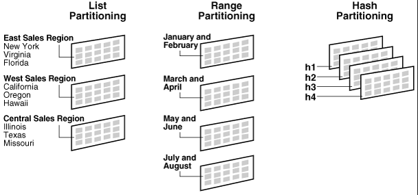
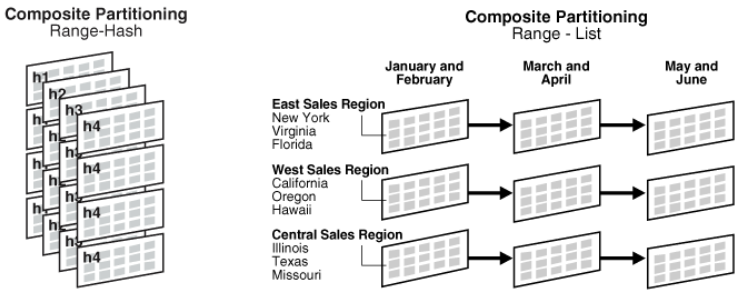
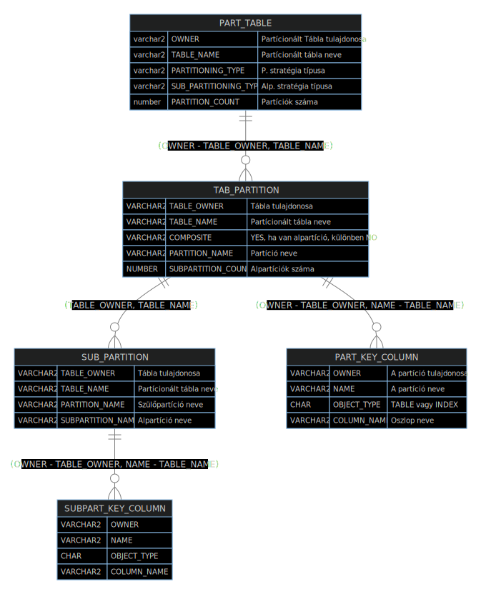
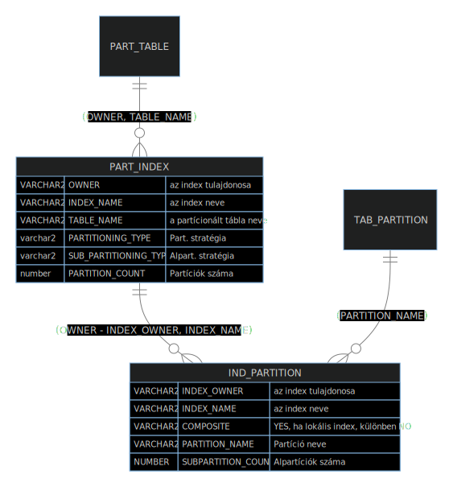

# Partíciók

Lehetőségünk van a táblákat (vagy indexeket) kisebb egységekre úgynevezett **partíciókra** osztani.

## Partícionálási stratégiák

Az egységre osztás három stratégia (intervallum, lista, hasítófüggvény) alapján történhet.

:::danger
Ha egy adott érték egyik partícióba se illene, a beszúrás meghiúsul.
:::

### Intervallum
A különböző partíciókba a megadott intervallumba eső értékek kerülnek. Például ha évszakok alapján hozunk létre
partíciókat, akkor az `[december 1., március 1.)` intervallum értékei egy partícióba (tél) kerülnek.

### Lista
Az intervallum stratégiához hasonló, de intervallum helyett az adott partícióba tartozó diszkrét értékeket kell
felsorolni.

### Hash
A rekordokat egy hasítófüggvény alapján helyezi partíciókba.

## Alpartíciók
A partíciókra lehetőségünk van alpartációkat készíteni (alpartíciókat viszont már nem tudjuk tovább partícionálni).

## Partíció indexek
A partíciókra is tudunk indexeket létrehozni. Ezek lokálisak (csak az adott partícióra vonatkozóak) vagy globálisak
(teljes táblára vonatkozóak) lehetnek. Ha az indexet az oszlopok olyan részhalmazára készítjük, amiben benne van az az
oszlop, mely alapján a partícionálást végeztük akkor lokális indexet különben globális indexet érdemes használni.

## Rendszerkatalógusok

A partícionált táblák/indexek rendszerkatalógusai a következők:

