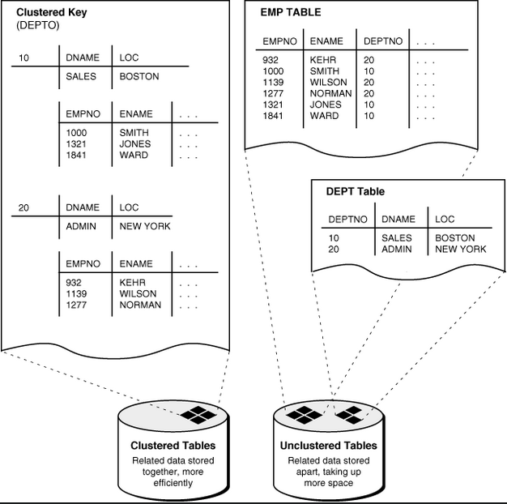

# Klaszterek

A klaszterezés egy alternatív táblaszervezés mód, ahol több tábla közös adatai egy helyen vannak tárolva. A táblákat
egy vagy több oszlop mentén tudjuk összekapcsolni, amit a **klaszter kulcsának** nevezünk.

Ez szorosan kapcsolódó táblák esetén gyorsabb összekapcsolást és kevesebb tárhelyigényt (ezáltal kevesebb IO-t) jelent.

:::danger
Ne használjunk klasztert, ha a következők bármelyike teljesül:
- a klaszter kulcs sokféle értéket felvehet
- sokszor kell az összes rekordot lekérni
- a tábla gyakran módosul
:::

## B+ fa klaszter
A klaszter kulcsra indexet készítünk. Beszúrásnál ezt használjuk, a sor helyének eldöntésére.

## Hash klaszter
Egy hasítófüggvény határozza meg hova kerüljenek a sorok. A hash klaszterezés a klaszter kulccsal történő
összehasonlítás esetén hatékony megoldást ad, intervallumlekérdezések esetén azonban még ront is a teljesítményen.

:::tip
Lehetőségünk van egyetlen táblából álló klasztert létrehozni. Ekkor lényegében a hash alapú klaszterezés indexként
működik.
:::

### Lineáris hashelés
