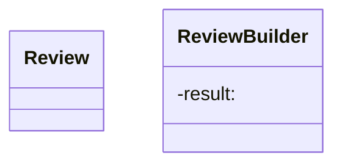

# Létrehozási minták

Objektum-létrehozási mechanizmusokat biztosítanak,
amelyek növelik a meglévő kód rugalmasságát és
újrafelhasználását.

## Gyártófüggvény

## Építő

Az építő minta lehetővé teszi, hogy objektumainkat lépésről-lépésre hozzuk létre, egy építő objektum segítségével.

