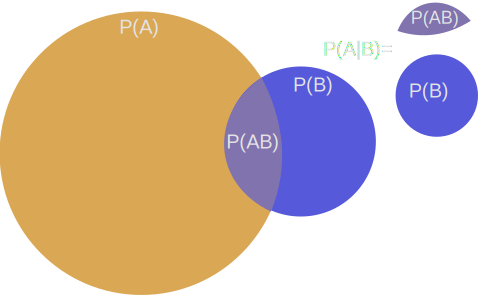

# Feltételes valószínűség

Szeretnénk, egy esemény valószínűségét egy másik esemény bekövetkeztének feltételezésével vizsgálni. Ehhez bevezetjük a
feltételes valószínűség fogalmát.

Az $A$ esemény valószínűségét azon feltétel mellett, hogy a $B$ esemény bekövetkezik, az $A$ esemény a $B$ eseményre
vonatkozó feltételes valószínűségét $\mathrm{P}(A\mid B)$-vel jelöljük és a következő módon definiáljuk:

$$
\mathrm{P}(A \mid B) = \frac{\mathrm{P}(A \cap B)}{\mathrm{P}(B)}
$$

Szemléletesen, a definíció jelentése a következő:

Tehát $\mathrm{P}(A\mid B)$ nem más mint $(A \text{ és } B)$ valószínűsége $B$ valószínűségéhez viszonyítva.

:::tip PÉLDA
Mennyi a valószínűsége, hogy két kockadobásnál mind a két dobás 6-os, feltéve, hogy tudjuk, hogy legalább az egyik dobás
6-os?

Két dolgot kell meghatároznunk:
- Annak a valószínűségét, hogy két 6-ost dobunk. $(A)$
- Annak a valószínűségét, hogy legalább 1 hatost dobunk. $(B)$

$$
\mathrm{P}(A) = \frac{1}{36},
\quad
\mathrm{P}(B) =
\underbrace{\frac{1}{6} \cdot \frac{5}{6}}_{\text{első dobás 6-os}} +
\underbrace{\frac{5}{6} * \frac{1}{6}}_{\text{második dobás 6-os}} +
\underbrace{\frac{1}{36}}_{\text{mindkét dobás hatos}}
= \frac{11}{36}
$$

Figyeljük meg, hogy $A \subset B$, ezért $A \cap B = A$  Alkalmazva a képletet azt kapjuk, hogy:
$$

\mathrm{P}(A \mid B) = \frac{\frac{1}{36}}{\frac{11}{36}} = \frac{1}{36} \cdot \frac{36}{11} = \frac{1}{11}

$$
:::

## Teljes valószínűség tétele

Tetszőleges $A$ esemény és $B_1, B_2, \dots$ teljes eseményrendszer esetén
$$
\mathrm{P}(A) = \sum_{i=1}^{\infty}{\mathrm{P}(A \mid B_i) \cdot P(B_i)} 
$$

## Bayes-tétel

Tetszőleges $A$ esemény és $B_1, B_2, \dots$ teljes eseményrendszer esetén
$$
\mathrm{P}(B_i \mid A) = \frac{\mathrm{P}(A \mid B_i) \cdot \mathrm{P}(B_i)}{\sum_{i=1}^{+\infty}{\mathrm{P}(A \mid B_i)} \cdot \mathrm{P}(B_i)}.
$$

:::tip PÉLDA
100 érme közül az egyik hamis (ennek mindkét oldalán fej található). Egy érmét véletlenszerűen kiválasztva és
azzal 10-szer dobva, 10 fejet kaptunk. Ezen feltétellel mi a valószínűsége, hogy a hamis érmével dobtunk?

Legyenek az események a következők:
- $A$: 10-ből 10 fejet dobunk
- $B_1$: hamis érmét választottuk ki
- $B_2$: nem hamis érmét választottuk ki

Ekkor:
- $\mathrm{P}(B_1) = \frac{1}{100}$
- $\mathrm{P}(B_2) = \frac{99}{100}$

Nem nehéz meggondolni a következőket sem:
- Ha, hamis érmével dobtunk, azaz $B_1$ igaz, akkor biztosan csak fejet dobunk, azaz $\mathrm{P}(A \mid B_1) = 1$
- Ha, nem hamis érmével dobtunk, azaz $B_2$ igaz, akkor $\left(\frac{1}{2}\right)^{10}$ eséllyel dobunk csak fejet, azaz $\mathrm{P}(A \mid B_2) = \frac{1}{2^{10}}$

Felhasználva a Bayes-tételt így:

$$
\mathrm{P}(B_1 | A) =
\frac{\mathrm{P}(A \mid B_1)\mathrm{P}(B_1)}{\mathrm{P}(A \mid B_1)\mathrm{P}(B_1)+\mathrm{P}(A \mid B_2)\mathrm{P}(B_2)} =
\frac{ \frac{1}{2^{10}} \cdot \frac{1}{100}}{1 \cdot \frac{1}{100} + \frac{1}{2^{10}} \cdot \frac{99}{100}} \approx 0,9118
$$
:::